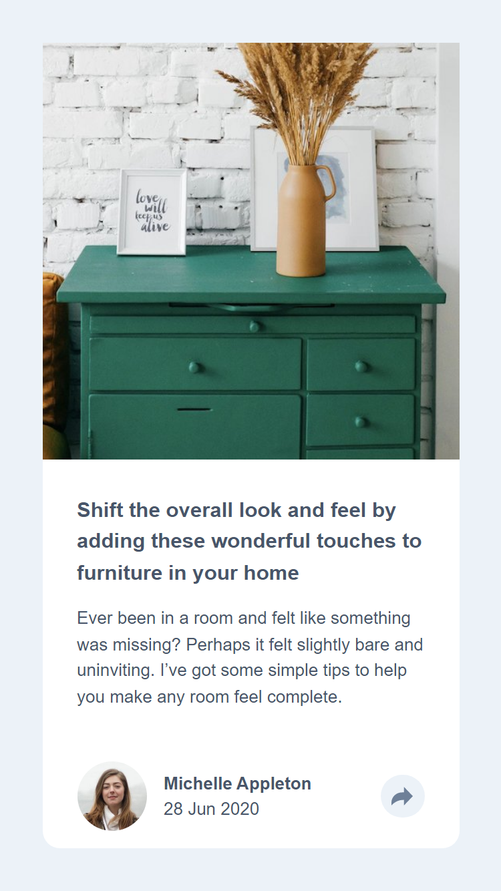

# Frontend Mentor - Article preview component solution

This is a solution to the [Article preview component challenge on Frontend Mentor](https://www.frontendmentor.io/challenges/article-preview-component-dYBN_pYFT). Frontend Mentor challenges help you improve your coding skills by building realistic projects. 

## Table of contents

- [Overview](#overview)
  - [The challenge](#the-challenge)
  - [Screenshot](#screenshot)
  - [Links](#links)
- [My process](#my-process)
  - [Built with](#built-with)
  - [What I learned](#what-i-learned)
  - [Continued development](#continued-development)
  - [Useful resources](#useful-resources)
- [Author](#author)
- [Acknowledgments](#acknowledgments)

## Overview

### The challenge

Users should be able to:

- View the optimal layout for the component depending on their device's screen size
- See the social media share links when they click the share icon

### Screenshot



### Links

- Solution URL: [https://github.com/ozanweb/article-preview-component-master]
- Live Site URL: [https://ozanweb.github.io/article-preview-component-master/]

## My process

### Built with

- Semantic HTML5 markup
- CSS
- Flexbox
- Mobile-first workflow
- JS
- Google fonts ([Manrope](https://fonts.google.com/specimen/Manrope))

### What I learned

```getElementById()``` this is the best way of storing single DOM element / node in a variable to use in JS

When units from the elements are fetched from the DOM to use in JS functions, units are always shown in ```px```. To eleminate the px suffix use ```parseInt()```
```defaultView.getComputedStyle()``` function is used to access the styles of an element the browser computes using related css file.

```mask-image``` which is a css property can be used to change the color of ```svg``` images.

Cropping images according to their parent element size. Use the image as a background image on a box element then set the display property as 'flex'

Changing the default font size of the browser using ```:root``` pseudo-class

### Continued development

Next challenge would be:

- When the share button is clicked bring the next element in slow motiong from left to right or viceversa. Use JS.


### Useful resources

- [https://www.frontendmentor.io/] the way how social media buttons should be presented on a webpage (in the html bone) was discovered by inspecting it.

## Author

- Frontend Mentor - [@ozanweb](https://www.frontendmentor.io/profile/ozanweb)
- LinkedIn - [@ozanpalanci](https://www.linkedin.com/in/ozanpalanci/)
